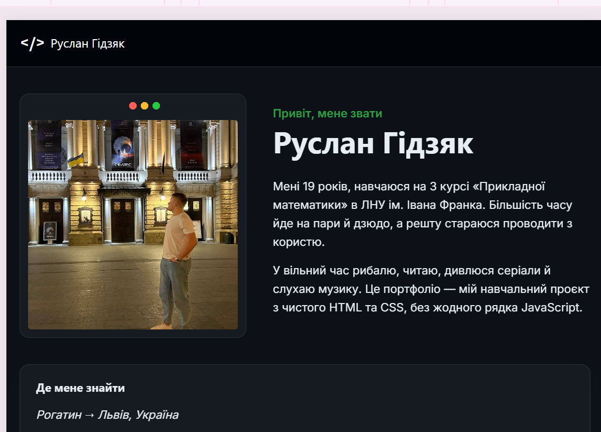
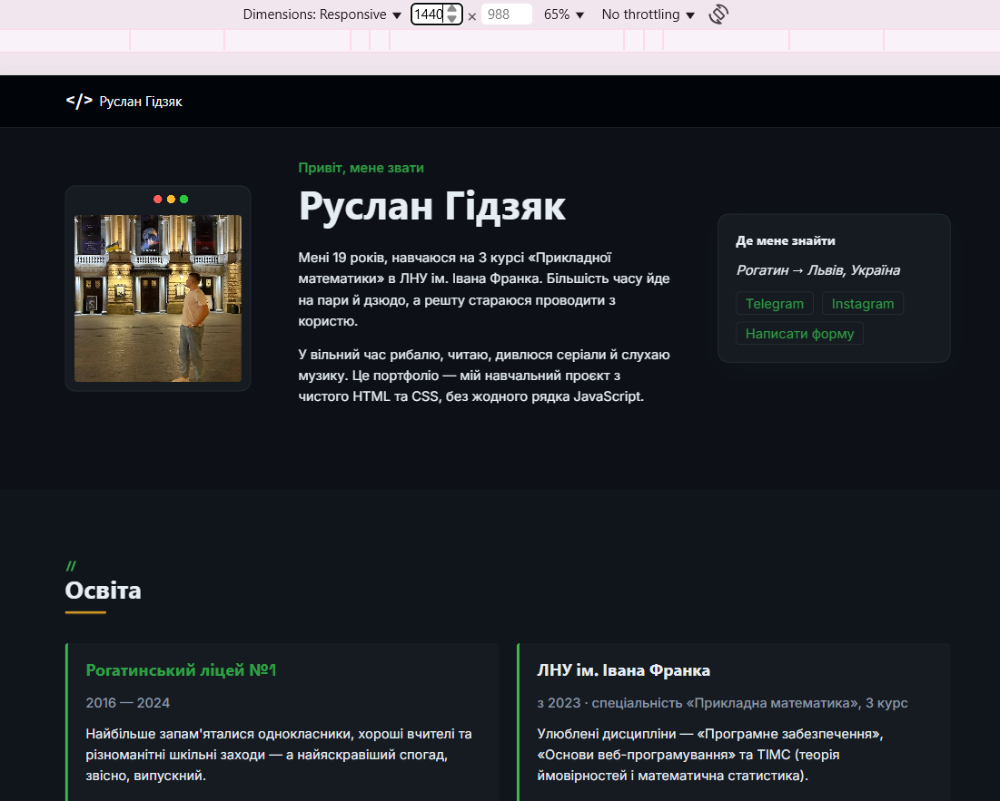
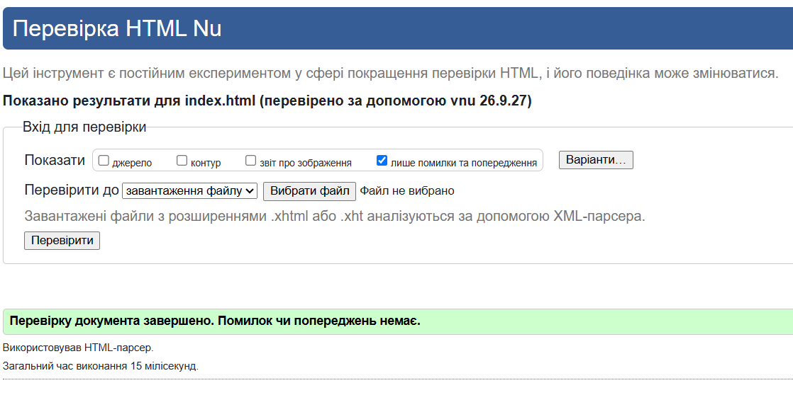
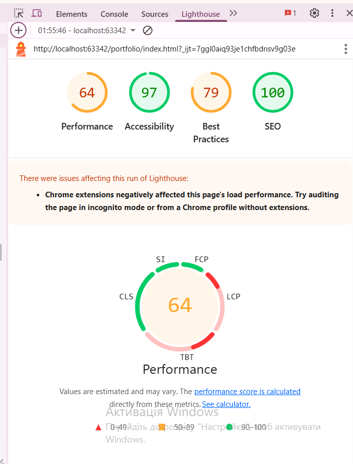

# Студентське портфоліо — Руслан Гідзяк

Особистий сайт-портфоліо для завдання №1 курсу «Основи web програмування» (ЛНУ ім. Івана
Франка). Верстка виконана виключно на HTML5 + CSS3, підхід **mobile first**, без JavaScript і
без CSS-фреймворків. Дизайн — тема «Редактор коду» (темна IDE-палітра, моноширинні акценти).

## Жива версія

https://ruslangidziak.github.io/portfolio/


## Структура проєкту

```
├── index.html
├── css/
│   └── styles.css
├── img/
│   └── (фото — портрет, хобі, книги, фільми, подорожі)
└── README.md
```

## Брейкпойнти та що змінюється

Обрано **два** брейкпойнти — `768px` та `1200px` (замість трьох рекомендованих 480/768/1200):
базові мобільні стилі вже коректно виглядають від 320 px без проміжного правки на 480 px, тож
третій брейкпойнт був би зайвим дублюванням. Це дає три чітко різні макети:

| Елемент | Мобільний (&lt;768px) | Планшет (768–1199px) | Десктоп (≥1200px) |
|---|---|---|---|
| Навігація | `details/summary`-«бургер» | Той самий бургер прихований, посилання в рядок | Те саме горизонтальне меню, шапка `sticky` |
| Секція «Про мене» | Фото → текст → контакти одна колонка | Grid-areas: фото + текст в ряд, контакти під ними | Grid-areas: фото, текст і бічна панель контактів в один рядок |
| Сітка хобі/книг/фільмів | 1 колонка (auto-fit) | 2–3 колонки (auto-fit) | Фіксовано 4/5/3 колонки |
| Галерея подорожей | 1 колонка | Сітка 2×N | Ширші картки в ряд |
| Форма контактів | Одна колонка | Дві колонки, чекбокс і кнопка на всю ширину | Без змін розкладки, ширші відступи |
| Типографіка | База ~16px, `clamp()` для заголовків | Проміжні значення `clamp()` | База 18px, `.about__content` обмежено `70ch` |

## Скріншоти макетів

### Мобільний (375px)


[Мобільний макет](img/screenshot-mobile.png)
### Планшетний (900px)



### Десктопний (1440px)



## Перевірка якості

### W3C Markup Validator



### Lighthouse (Accessibility / Best Practices ≥ 90, режим Mobile)



## Контраст кольорів

Палітра «Редактор коду» побудована на дуже темному фоні (`#0d1117`) зі світлим текстом
(`#e6edf3`) — базовий контраст тексту дуже високий. Найризикованіші пари для перевірки в
[WebAIM Contrast Checker](https://webaim.org/resources/contrastchecker/):

1. `--color-sage` (`#3fb950`) як колір тексту на фоні `--color-paper` (`#0d1117`) — орієнтовно ~7:1.
2. `--color-gold` (`#d29922`) на фоні `--color-navy` (`#010409`) — орієнтовно ~8:1.
3. `--color-ink-soft` (`#8b98a5`) на фоні `--color-paper-alt` (`#10151c`) — найближчий до межі 4.5:1, перевірити першим.

## Використання генеративного ШІ

- **Інструмент:** Claude (Anthropic).
- **Для чого використано:** допомога у структуруванні HTML/CSS-коду та оформленні
  текстів розділів на основі особистих даних, які я надав; допоміг зробити три адаптивні
  макети (мобільний, планшетний, десктопний) та оформити розділи сайту.
- Фото, соцмережі та фінальний вміст — додані та перевірені мною особисто.

## Чеклист перед здачею

- [x] Усі 15 розділів наповнені реальними даними
- [x] Додано власні фото
- [x] Telegram та Instagram — реальні посилання
- [ ] Пройдено W3C Markup Validator без помилок
- [ ] Lighthouse (Mobile) ≥ 90 за Accessibility та Best Practices
- [ ] Не менше 8 осмислених комітів у Git
- [ ] Сайт опубліковано (GitHub Pages), посилання додано вище
- [x] Заповнено розділ «Використання ШІ»
